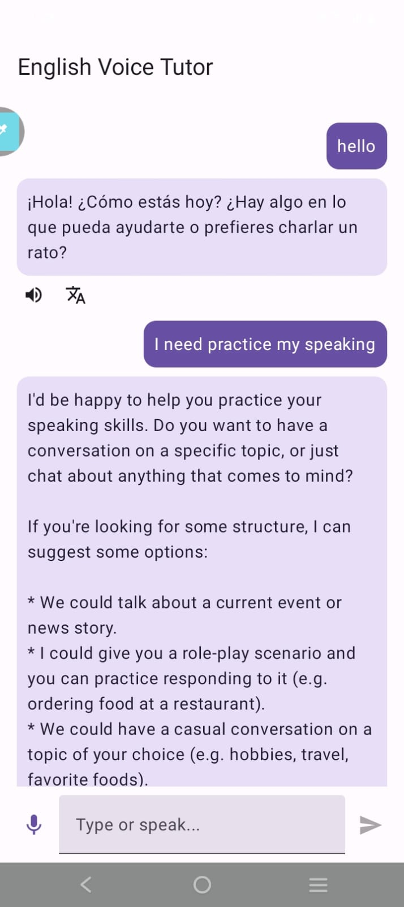
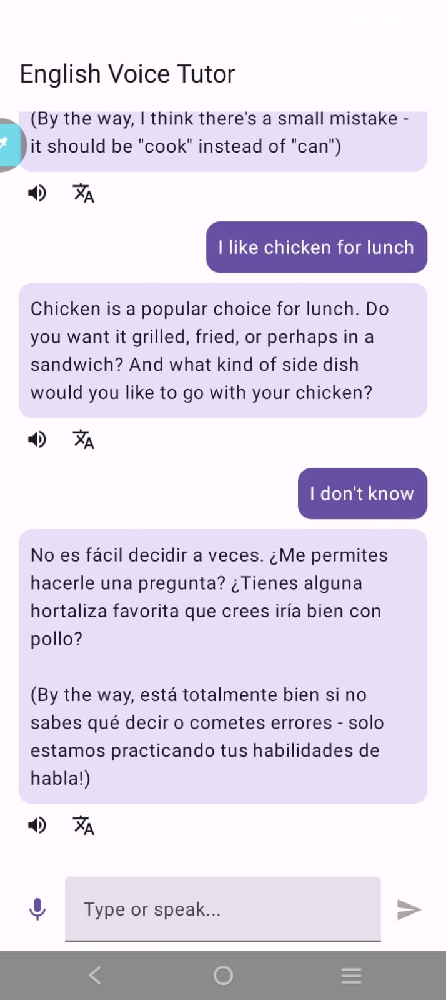
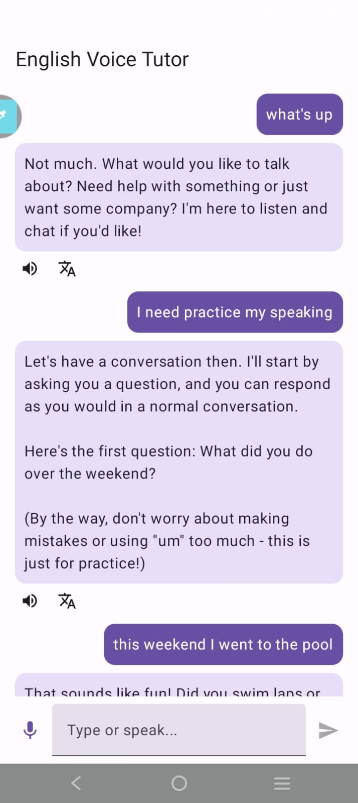

<!-- markdownlint-disable MD033 MD041 -->

  

<h1 align="center">🎤 English Voice Tutor</h1>

  <strong>App Android para practicar inglés conversacional con IA local</strong>

  
  
  

---

## 📱 Capturas de Pantalla

<table align="center">
  <tr>
    <td align="center" width="33%">
      
       
      <strong>🎤 Conversación con voz</strong>
    </td>
    <td align="center" width="33%">
      
       
      <strong>🌐 Traducción instantánea</strong>
    </td>
    <td align="center" width="33%">
      
       
      <strong>🏠 Pantalla principal</strong>
    </td>
  </tr>
</table>

---

## ✨ Características

- **🎙️ Reconocimiento de voz**: Habla en español, responde en inglés
- **🔊 Síntesis de voz**: Escucha las respuestas del modelo
- **🌐 Traducción contextual**: Toque para ver traducción al español
- **🤖 Modelo local**: Llama 3.1 8B vía Ollama (sin internet necesaria)
- **📱 UI moderna**: Jetpack Compose con Material 3
- **⚡ Respuestas rápidas**: Coroutines y Flow para performance

---

## 🛠️ Requisitos

- **Android Studio** (Hedgehog o superior)
- **Ollama** corriendo con `llama3.1:8b`
- **Configurar IP** en `gradle.properties` global

---

## 🚀 Instalación

1. **Clonar**: `git clone https://github.com/gusrivera1981/EnglishTutor.git`
2. **Abrir** en Android Studio
3. **Configurar** IP en `~/.gradle/gradle.properties`
4. **Ejecutar** la app

---

## 📝 Uso

1. Ejecuta la app
2. Permite el micrófono
3. Habla en español
4. Escucha la respuesta en inglés
5. Toca los iconos debajo del mensaje

---

  <i>Hecho con ❤️ y ☕ en Android Studio</i>

